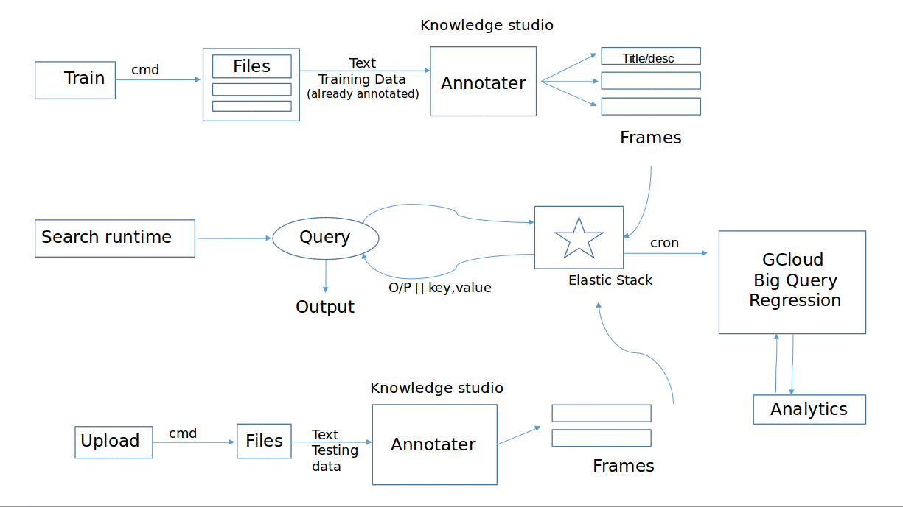

# Context based search engine
Fuzzy searching based on annotated and related documents
___

<br />

- [X] Fuzzy search
- [X] Elasticsearch
- [X] Annotation/classification
- [X] Logs Collector
- [X] Chart log data
- [ ] BigQuery
- [ ] Hadoop

<br />
<br />

### Instructions to run

<br />

```bash
$ chmod +x run
$ ./run
```

<br />


### Benchmarks on localhost

<br />

| Operation performed |  Data involved | Time taken |
|:---:|:---:|:---:|
| Extract all text | 20 files (PDFs), 66799 lines of text | 1538 ms |
| Search for given key | Query sent to stored data on elasticsearch | 6 ms |
| Give JSON from logs | Log data: timestamp, query, hits, time, maxScore | 2 ms |
| Load all existing data to elastic | 20 files loaded to elastic, with text, removed buffers | 1140 ms |

<br />
<br />


| Service name | Role | PORT |
|:---:|:---:|:---:|
| gorest | Main text extraction/annotation/search API | 3000 |
| elasticsearch | Mount and fuzzy search data | 9200 |

<br />
<br />


